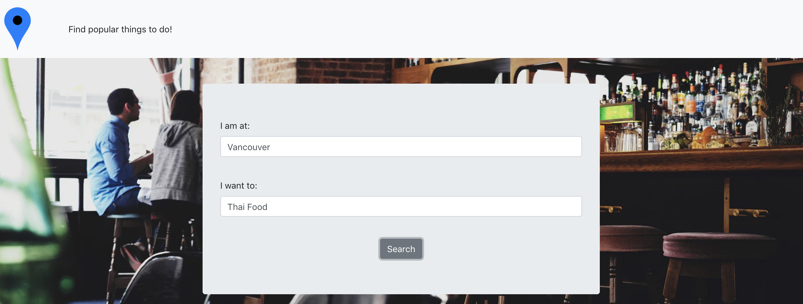
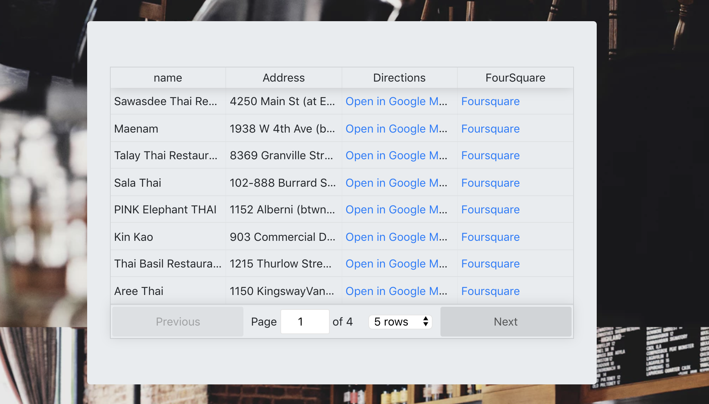
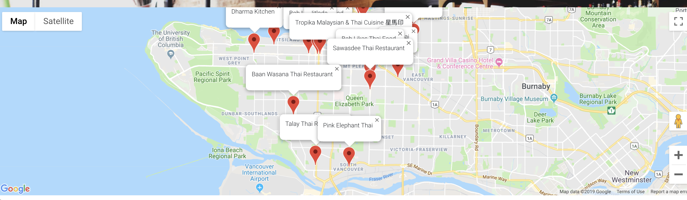

## Activity Finder 

Single-page web application to help you find the most popular activites at any location. User can input any location, an activity (Such as Thai Food, bikingm, shopping) and the most popular results according to Foursquares API will return. 

Front-end is built using React.js, Back-end is built using Node.js with an Express Server. 

This also uses extral APIS from Foursquare and Google Map, to display location and map information. 

You will need to obtain a Foursquare API key in order to run this project. 

### Screenshots




### Worflow Video
[Available on Dropbox](https://www.dropbox.com/s/ou020hudpu37knb/screencast.mov?dl=0)

### Tech Stack

* Node.js
* React
* Express

### Dependencies

* react
* axios
* bootstrap
* reactstrap
* react-google-maps
* react-table
* express
* bodyParser
* morgan
* dotenv

### Setup
1. Fork and Clone
2. Follow below instructions to install dependencies: In the command line:

```
cd client
npm i
cd ..
cd app
npm i
```
3. Create .env file in server folder, copy Foursquare API keys in the following format: 

Server: 
FS_CLIENT_ID=['insert Foursquare client id']
FS_CLIENT_SECRET=['insert Foursquare client secret']

As for Google API, please note that due to limits with API requests, the map may be greyed out. The API key used in this project can only be used on this app. 

App:
GOOGLE_MAPS_API=['insert google maps id']

4. Open two command windows and type the following to start: 

cd to Server
```
node server.js
```

cd to App
```
npm start
```

5. Open http://localhost:3000 in a browser.
